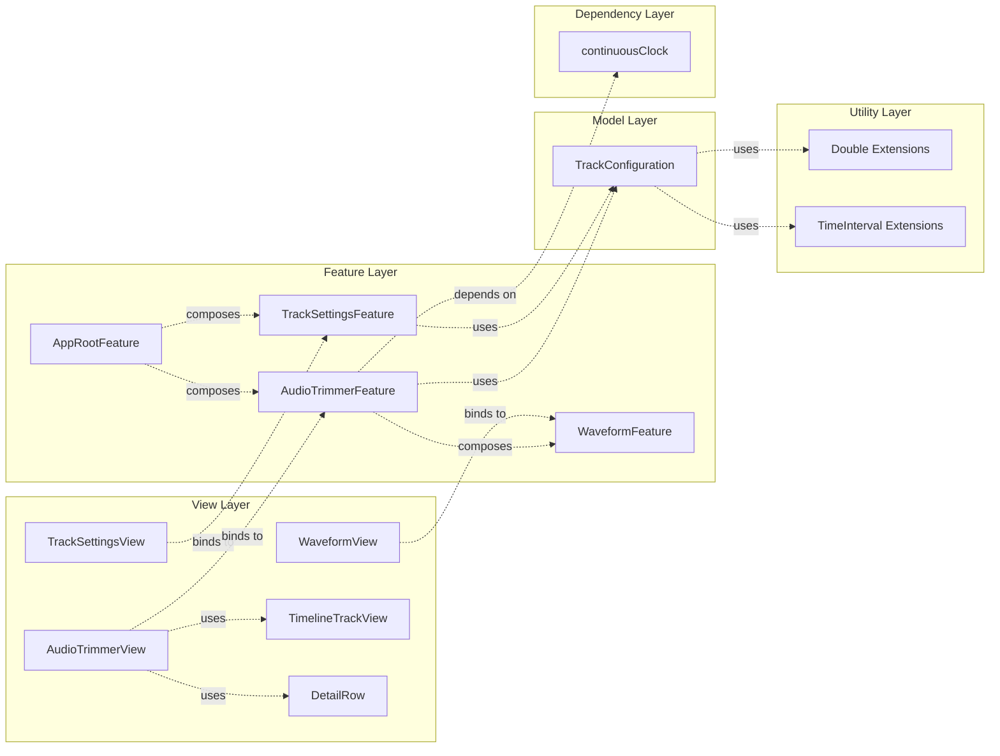

# Audio Trimmer

Audio Trimmer models an audio trimming experience using SwiftUI and The Composable Architecture (TCA) 1.23.0.
The Swift package encapsulates all business logic and can be reused by the iOS host app for previews and
simulator builds.

## Requirements
- macOS 14.4 or later with Xcode 16 (or an equivalent Swift 6 toolchain that satisfies `swift-tools-version: 6.2`)
- Swift 5.10+ source compatibility (keep the toolchain aligned with TCA 1.23.0 as noted in the repo guidelines)
- iOS 18.0, macOS 15.0, or visionOS 2.0 SDKs for platform builds

## Repository Layout
```text
Audio Trimmer/
├─ App/Package.swift                      # SwiftPM manifest for the reusable package
├─ App/Sources/App/Features/AppRoot/     # App root feature reducer & view for navigation
├─ App/Sources/App/Features/AudioTrimmer/ # Audio trimming feature reducer & dependencies
├─ App/Sources/App/Features/TrackSettings/ # Track settings entry form feature reducer & view
├─ App/Sources/App/Features/Waveform/     # Waveform visualization feature reducer & view
├─ App/Sources/App/Models/                # Cross-platform domain models
├─ App/Sources/App/Extensions/            # Shared helpers (Double+Extensions, TimeInterval+Extensions)
├─ App/Sources/App/Views/                 # Reusable UI components (TimelineTrackView, etc.)
├─ App/Tests/AppTests/                    # Swift Testing + TCA TestStore coverage
├─ Audio Trimmer.xcodeproj                # iOS shell + asset catalog
└─ README.md                              # Single source of truth for build & architecture
```

## Build & Run
- Build the Swift package:
  ```bash
  swift build --package-path "Audio Trimmer/App"
  ```
- Run the unit test suite:
  ```bash
  swift test --package-path "Audio Trimmer/App"
  ```
- Build the shell app in the simulator (useful for SwiftUI previews):
  ```bash
  xcodebuild \
    -project "Audio Trimmer.xcodeproj" \
    -scheme "Audio Trimmer" \
    -destination 'platform=iOS Simulator,name=iPhone 15' \
    build
  ```

## Architecture
- Reducer-first design using TCA macros (`@Reducer`, `@ObservableState`) keeping side effects in the dependency
  system and out of SwiftUI views.
- Each feature reducer lives under `Audio Trimmer/App/Sources/App/Features/<FeatureName>/` and exposes its state,
  actions, and body from a single type.
- Dependencies are surfaced through `DependencyValues`; the package uses TCA's `continuousClock` for time-based effects.
- Views bind to `StoreOf<Feature>` and derive navigation/scoped state rather than owning mutable data.
- Navigation is managed through TCA's `NavigationStackStore` with path-based state management in `AppRootFeature`.

### Project Architecture Diagram


### Dependency Diagram



**Legend:**
- **Solid arrows (→)**: Direct composition/ownership
- **Dashed arrows (-.->)**: Dependency/usage relationship

### AppRootFeature
`Audio Trimmer/App/Sources/App/Features/AppRoot/AppRootFeature.swift`

- **State** manages the root navigation state with `TrackSettingsFeature.State` and a `StackState<Path.State>` for navigation paths.
- **Actions** handle navigation path actions and delegate actions from `TrackSettingsFeature` to navigate to `AudioTrimmerFeature`.
- **Navigation** uses TCA's path-based navigation system to manage transitions from track settings entry to audio trimming view, with `AppRootView` utilizing `IfLetStore` for conditional navigation rendering.
- **Composition** scopes `TrackSettingsFeature` and manages navigation to `AudioTrimmerFeature` through the path stack.

### TrackSettingsFeature
`Audio Trimmer/App/Sources/App/Features/TrackSettings/TrackSettingsFeature.swift`

- **State** manages form input fields (total duration, key times, clip start, clip percent) with field-level error messages and computed `isConfirmEnabled` validation.
- **Actions** handle text field bindings, confirm button taps, and delegate actions to communicate validated configuration to the parent.
- **Validation** parses and validates input fields, normalizes key times (clamp, round, sort, unique), and maps valid inputs to `TrackConfiguration`.
- **Error handling** provides field-specific error messages for invalid inputs and prevents navigation until all fields are valid.

### AudioTrimmerFeature
`Audio Trimmer/App/Sources/App/Features/AudioTrimmer/AudioTrimmerFeature.swift`

- **State** tracks the `TrackConfiguration` (passed via initialization), the current `PlaybackState`, a derived
  `TimelineSnapshot`, and a scoped `WaveformFeature.State` for waveform visualization.
- **Actions** cover playback controls (`playTapped`, `pauseTapped`, `resetTapped`, `tick`), view appearance (`onAppear`), marker interaction (`markerTapped`), waveform drag interactions (`waveformDragChanged`, `waveformDragEnded`), and waveform actions (`waveform`).
- **Playback state** includes `idle`, `playing`, `paused`, `pausedByDrag`, and `finished` statuses, with helper properties `isPlaying` and `wasPausedByDrag` for state checks.
- **Effects** start a cancellable timer (`TimerID.playback`) when playback begins and cancel it when
  playback pauses, finishes, or resets. The reducer uses `@Dependency(\.continuousClock)` for timer delivery.
- **Drag support** automatically pauses playback when waveform dragging starts (`pausedByDrag` status) and resumes playback when dragging ends, converting scroll offset to clip start position in real-time.
- **Derived data** is rebuilt through `updateDerivedState`, ensuring `TimelineSnapshot` stays consistent with the
  active configuration and playback progress. The feature tracks clip progress separately from overall playback
  progress, providing more granular control over the trimming experience.
- **Composition** scopes `WaveformFeature` as a child reducer, enabling synchronized state between audio trimming and waveform visualization.

### WaveformFeature
`Audio Trimmer/App/Sources/App/Features/Waveform/WaveformFeature.swift`

- **State** manages waveform visualization parameters including `totalDuration`, `clipStart`, `clipDuration`, `scrollOffset`, drag state, and `clipProgressPercent`. Includes a `ViewConfiguration` struct for layout parameters.
- **Actions** handle drag gestures (`dragStarted`, `dragChanged`, `dragEnded`), scroll synchronization (`syncDragStartOffset`, `updateScrollOffsetFromClipStart`), and clip progress updates.
- **Behavior** provides drag-and-scroll functionality for interactive waveform navigation, with scroll offset automatically synchronized to clip position changes.
- **Scroll offset calculation** uses the valid clip start range (`maxClipStart = totalDuration - clipDuration`) instead of total duration, ensuring accurate positioning when the clip duration is less than the total duration.

### Domain Models
- `TrackConfiguration` (`Audio Trimmer/App/Sources/App/Models/TrackConfiguration.swift`) defines the raw trimming
  metadata, exposes derived ranges (`clipRangeSeconds`, `normalizedClipRangePercent`, `normalizedKeyTimesPercent`),
  and keeps values clamped to valid bounds.
- `AudioTrimmerFeature.TimelineSnapshot` converts the configuration into UI-ready percentages for the playback
  timeline and marker positions.
- `Double+Extensions` (`Audio Trimmer/App/Sources/App/Extensions/Double+Extensions.swift`) provides formatting and
  clamping utilities for numeric values.
- `TimeInterval+Extensions` (`Audio Trimmer/App/Sources/App/Extensions/TimeInterval+Extensions.swift`) provides
  time formatting methods for display purposes.


## SwiftUI Shell
- `AppRootView` (`Audio Trimmer/App/Sources/App/Features/AppRoot/AppRootView.swift`) is the main SwiftUI entry point that initializes
  and provides the `AppRootFeature` store, managing navigation between `TrackSettingsView` and `AudioTrimmerView` using `IfLetStore` for conditional navigation.
- `TrackSettingsView` (`Audio Trimmer/App/Sources/App/Features/TrackSettings/TrackSettingsView.swift`) provides the entry form for track configuration with:
  - Input fields for track length, key times, clip start, and clip percent with appropriate keyboard types (numberPad for numeric fields, default for key times)
  - Pre-filled example values for better user experience
  - Real-time field validation with error messages
  - Confirm button that enables only when all fields are valid
  - Navigation to audio trimmer view upon successful validation
- `AudioTrimmerView` (`Audio Trimmer/App/Sources/App/Features/AudioTrimmer/AudioTrimmerView.swift`) implements
  the complete UI for audio trimming, including:
  - Timeline visualization with clip range and key time markers
  - Playback controls (play, pause, reset)
  - Clip details display (start time, duration, end time)
  - Progress tracking for both overall playback and clip-specific progress
  - Interactive waveform visualization with drag-and-scroll functionality that automatically pauses and resumes playback
- `WaveformView` (`Audio Trimmer/App/Sources/App/Features/Waveform/WaveformView.swift`) provides a scrollable
  waveform visualization with:
  - Dynamic layout based on clip duration and total duration
  - Drag gesture support for manual scrolling
  - Progress indicator showing clip playback progress
  - Automatic scroll synchronization with clip position changes
- `TimelineTrackView` (`Audio Trimmer/App/Sources/App/Views/TimelineTrackView.swift`) is a reusable component
  for displaying timeline tracks with:
  - Clip range visualization
  - Interactive key time markers
  - Progress indicator with view bounds constraints to prevent overflow
  - Marker tap handling for clip position adjustment
- Assets dedicated to iOS belong in `Audio Trimmer/Assets.xcassets`; cross-platform logic stays inside the Swift
  package so the package tests and the Xcode target share the same code.

## Testing
- Tests live under `Audio Trimmer/App/Tests/AppTests/` and use the Swift `Testing` package alongside TCA's
  `TestStore`. The current coverage includes:
  - **TrackSettingsTests.swift** verifies:
    - Valid inputs navigate to AudioTrimmer with correct configuration.
    - Invalid inputs show field-level errors and prevent navigation.
    - Key times validation and normalization (clamp, round, sort, unique).
    - Clip window validation (clip end must not exceed track length).
  - **AudioTrimmerTests.swift** verifies:
    - Timeline and waveform initialization on view appearance.
    - Playback timers tick until completion and respect pause/reset.
    - Timeline snapshots reflect derived ranges and markers.
    - Clip progress tracking works independently from overall playback progress.
    - Marker tap interactions adjust clip position correctly.
    - Waveform scroll offset synchronization with clip start.
    - Test logic is streamlined with helper functions (`expectTick`, `expectScrollOffsetUpdate`, `expectMarkerTappedStateUpdate`) for improved maintainability.
  - **WaveformTests.swift** verifies:
    - Drag gesture state management (start, change, end).
    - Scroll offset synchronization with clip position.
    - View configuration calculations.
    - Clip progress percentage updates.
- Run `swift test --package-path "Audio Trimmer/App"` before opening a pull request or merging changes.

## Development Workflow
- Maintain compatibility with TCA 1.23.0 and keep reducer macros up to date.
- When adding features, create a new reducer in `Features/`, expose dependencies via `DependencyValues`, and
  compose them using `Scope` from parent reducers.
- Keep business logic inside reducers/effects and drive SwiftUI through state bindings and actions.
- Follow Conventional Commits (e.g. `feat: add waveform trimming reducer`) and document verification commands in
  pull requests.
- Prefer command-line builds/tests for fast feedback; use `xcodebuild … build` or Xcode previews for UI-only work.

## Recent Changes

### Added
- Added drag support for waveform interaction, allowing users to adjust clip start position by dragging the waveform
- Added automatic playback pause during waveform drag with resume functionality when drag ends
- Added scroll offset to clip start conversion logic for real-time position updates during drag
- Added view bounds constraints to `TimelineTrackView` to prevent visual elements from exceeding view boundaries
- Added keyboard type options to `TrackSettingsView` text fields (numberPad for numeric fields, default for key times)
- Implemented `AppRootFeature` and `AppRootView` for root-level navigation management using TCA's `NavigationStackStore`
- Added `TrackSettingsFeature` and `TrackSettingsView` for track configuration entry form with validation
- Added form input fields for track length, key times, clip start, and clip percent with real-time validation
- Added field-level error messages and computed `isConfirmEnabled` state for form validation
- Added key times normalization (clamp, round, sort, unique) and validation (0-100% range)
- Added navigation from track settings to audio trimmer view with validated `TrackConfiguration`
- Added comprehensive test coverage for `TrackSettingsFeature` including valid/invalid input scenarios
- Enhanced `AudioTrimmerTests` to verify timeline and waveform initialization on view appearance
- Improved time formatting precision in `TimeInterval+Extensions.formattedSeconds()` to show one decimal place

### Changed
- Updated default text field values in `TrackSettingsFeature` state to provide example values for better user experience
- Updated `AppRootView` navigation to use `IfLetStore` for conditional navigation to `AudioTrimmerView`
- Updated `TrackSettingsView` layout to use `VStack` instead of `Group` for improved structure
- Updated waveform scroll offset calculation to use valid clip start range instead of total duration
- Updated app entry point from `RootView` to `AppRootView` for enhanced navigation structure
- Modified `AudioTrimmerFeature` to accept `TrackConfiguration` via initialization instead of loading from dependency
- Updated `AudioTrimmerView` to remove configuration loading on task completion
- Enhanced test coverage for timeline initialization, waveform scroll offset, and clip progress percentage

### Fixed
- Fixed default text values in `TrackSettingsFeature` state to provide initial example values instead of empty strings

### Refactored
- Refactored `AudioTrimmerTests` with helper functions (`expectTick`, `expectScrollOffsetUpdate`, `expectMarkerTappedStateUpdate`) to improve test readability and maintainability
- Simplified navigation in `AppRootView` using `IfLetStore` instead of `CaseLet` for cleaner conditional rendering
- Removed `ConfigurationLoader` dependency and configuration loading functionality from `AudioTrimmerFeature`
- Restructured navigation to use path-based state management in `AppRootFeature` instead of direct state management
- Simplified parsing and validation logic in `TrackSettingsFeature` with clearer error handling
- Updated `AudioTrimmerFeature` to use `onAppear` action for initialization instead of configuration loading

## Next Steps
- Add validation enhancements to track settings (disable confirm button during validation, improved error messages)
- Implement key times normalization UI feedback to show normalized values to users
- Add seek and scrub functionality to allow users to jump to specific positions in the audio
- Extend waveform visualization with actual audio waveform data rendering instead of placeholder icons
- Enhance marker editing to allow dragging markers to adjust clip boundaries dynamically
